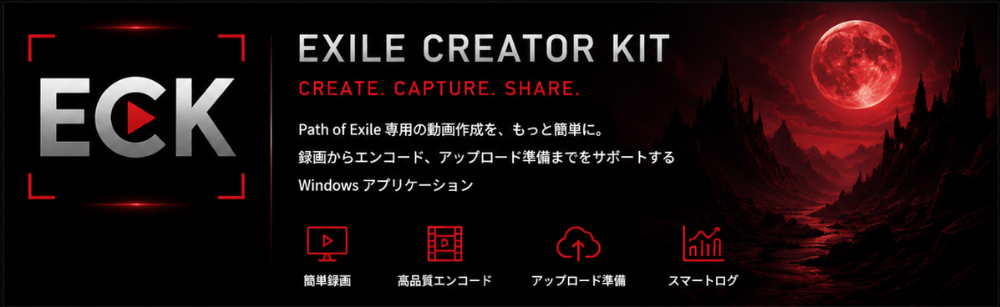
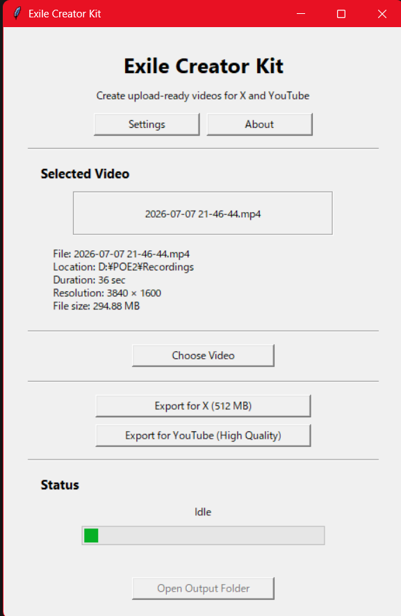

# Exile Creator Kit

  

  

Create upload-ready videos for X and YouTube in just a few clicks.

Exile Creator Kit (ECK) is a free and open-source Windows application designed for Path of Exile players and content creators who want to share great gameplay without learning FFmpeg or dealing with complicated export settings.

> **Release Candidate:** `v1.2.0-rc.1`  
> [Download the latest release](https://github.com/Noname0774/exile-creator-kit/releases/latest)
>
> Do **not** use **Code -> Download ZIP** unless you want the source code.

---

## Why Exile Creator Kit?

Most players do not want to learn video encoding.

They simply want to:

- Clip an amazing boss kill.
- Share it on X.
- Upload it to YouTube.
- Get back into the game.

ECK removes the technical barriers.

No command lines.

No FFmpeg knowledge.

No complicated settings.

Just choose your video and export.

---

## Screenshot

Current v1.2 release candidate UI:

---

## Features

- Export for **X (512 MB optimized)**
- Export for **YouTube (High Quality)**
- Export Preset System:
  - X (512 MB)
  - YouTube (High Quality)
  - YouTube Shorts
  - Discord
  - Custom
- Smart Environment:
  - GPU detection
  - automatic encoder recommendation
  - FFmpeg / FFprobe environment checks
- Preflight checks before export
- Premium dark UI
- Automatic Smart Bitrate
- Automatic Media Information
- Export History
- Settings Management
- Built-in FFmpeg support
- MIT Licensed
- Open Source

---

## Quick Start

1. Download the latest release.
2. Extract the ZIP archive.
3. Launch **ExileCreatorKit.exe**.
4. Choose your video.
5. Select an export preset.
6. Click **Export for X** or **Export for YouTube**.

That's it.

---

## Designed For

Exile Creator Kit is designed for players who want to share clips, not learn video encoding.

Whether you're:

- posting a funny moment on X,
- uploading a boss guide to YouTube,
- or simply saving highlights,

ECK keeps the workflow simple.

---

## System Requirements

- Windows 10 / Windows 11
- NVIDIA GPU recommended for NVENC
- Software H.264 fallback available
- FFmpeg included with release builds

No Python installation required.

---

## Project Goals

Our philosophy is simple:

- Make sharing gameplay effortless.
- Keep the interface clean.
- Build software that stays maintainable.
- Stay fully open source.

We prioritize usability over complexity.

---

## Roadmap

### Version 1.2.0-rc.1

- Premium UI release candidate
- Smart Environment foundation
- Export Preset System
- Preflight enforcement
- Hardened FFprobe error handling
- Release Candidate validation checklist

### Future

- Final v1.2.0 release
- Real FFmpeg progress
- Export cancellation
- More creator workflows
- Community-driven improvements

---

## Contributing

Bug reports, ideas and pull requests are always welcome.

Please use GitHub Issues for bug reports and feature requests.

---

## License

This project is released under the **MIT License**.

See the LICENSE file for details.

---

## Thank You

Exile Creator Kit started with a simple idea:

> **Help Path of Exile players share great moments without fighting their tools.**

If ECK makes sharing your gameplay easier, then the project has achieved its goal.

Thank you for using Exile Creator Kit.
